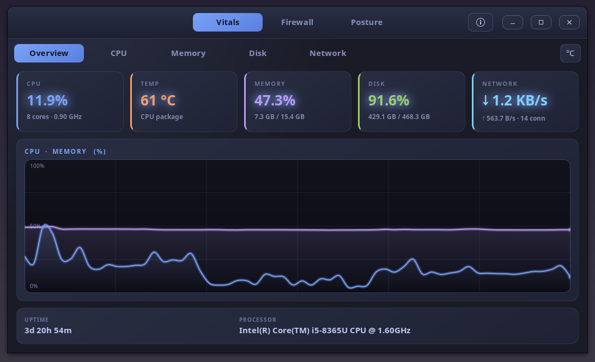

<div align="center">


<a href="https://github.com/effjy/sentinel/"></a>

**One window for the whole machine, with real-time checks — live system
vitals, a per-process outbound firewall, and continuous security-posture
monitoring, reunited into a single GTK4 app.**

<sub>GTK4 · C++17 · nftables + NFQUEUE · /proc & /sys · no heavy dependencies</sub>

<br>

[](LICENSE)
[](https://en.cppreference.com/)
[](https://www.gtk.org/)
[](https://www.netfilter.org/)
[](https://www.gnu.org/software/make/)
[](https://www.kernel.org/)
[](https://github.com/effjy/sentinel/releases)

</div>

---

## Screenshot

<div align="center">



</div>

---

Sentinel reunites three of the author's single-purpose tools —
[**Pulse**](https://github.com/effjy/pulse) (system monitor),
[**Warden**](https://github.com/effjy/warden) (outbound firewall) and
[**Envision**](https://github.com/effjy/envision) (security-posture scanner) —
behind one Tokyo Night window with a top-level switcher:

| Tab | From | What it does | Real-time? |
|---|---|---|---|
| **Vitals** | Pulse | CPU (total & per-core), temperature (°C/°F), memory & swap, per-filesystem disk + live I/O, network up/down & connections | 1 Hz polling of `/proc` and `/sys` |
| **Firewall** | Warden | Pauses every *new* outbound TCP connection, names the binary and destination, and waits for your verdict; live activity log + saved-rules manager | event-driven (NFQUEUE) |
| **Posture** | Envision | Full security-posture scan (listening ports, SSH, sudo, kernel sysctls, SUID, MAC, …) with a severity summary, findings list, and a **live "Changes" feed** | **continuous re-scan + diffing**, plus two always-on push watchers (below) |

The headline addition over the three originals is that **Envision's one-shot
audit becomes a real-time monitor**: the daemon re-runs the scan on an interval,
diffs it against the previous result, and pushes a change alert the moment a new
problem appears (a port opens, a service fails, a SUID binary lands) — or clears.

Two further watchers feed the same live "Changes" feed without waiting for a
scan interval at all — they're push-based, driven straight by the kernel or the
journal:

- **Process-exec monitor** — subscribed to the kernel's proc-connector
  (`NETLINK_CONNECTOR`), so every `exec()` on the box is seen the instant it
  happens. Execs from a handful of paths a normal install never runs from
  directly (`/tmp`, `/var/tmp`, `/dev/shm`, …) or of an already-unlinked
  (deleted) binary — both classic signs of a dropped or memory-resident
  payload — raise a HIGH alert naming the path, PID, parent PID and command.
- **Auth/login monitor** — tails the systemd journal (`journalctl -f`) for
  `sshd`, `sudo`, `su`, `useradd`, `userdel`, `groupadd` and `usermod`
  entries: a new SSH login, a burst of failed logins from one source (a
  possible brute-force), a sudo invocation, or a new/removed/modified
  account all surface live, instead of only catching *configuration* drift
  (e.g. a new NOPASSWD rule) on the next posture re-scan.

Both watchers degrade gracefully if their kernel feature or `journalctl` isn't
available (e.g. a container without `CAP_NET_ADMIN`, or a non-systemd host):
the daemon logs a warning and keeps running with everything else intact. Either
can be turned off with `SENTINEL_DISABLE_EXEC_WATCH=1` / `SENTINEL_DISABLE_AUTH_WATCH=1`.

---

## How it works

Sentinel is two processes that speak a tiny newline/tab text protocol over one
Unix socket (`/run/sentinel.sock`):

| Component | Runs as | Job |
|---|---|---|
| **`sentinel-daemon`** | root (systemd) | The firewall backend (nftables → NFQUEUE → process attribution → rule store), the posture scanner, **and** two live watchers (process-exec via the kernel proc-connector, auth/login via a `journalctl -f` tail). A single `poll()` loop services the firewall socket, the GUI socket, and both watcher file descriptors; posture scans run on a **worker thread** so a filesystem-wide SUID sweep never stalls a connection decision. Finished scans and watcher events are framed/diffed on the main thread and streamed to the GUI. |
| **`sentinel`** | your user (GTK4) | The three pages. The Firewall page owns the socket and is the I/O hub: firewall traffic drives its prompt/log, and posture frames on the same socket are forwarded to the Posture page. The Vitals page needs no privileges and just reads `/proc`/`/sys`. |

Design properties inherited from the originals still hold: the nftables rule is
installed with `bypass` and the daemon **fails open** when no GUI is connected;
allow-rules are pinned to the binary's **SHA-256** (tamper-evident); and the
control socket is gated by `SO_PEERCRED` to the first non-root user (override
with `SENTINEL_ALLOW_UID`). The posture re-scan runs as root, so privileged
checks (`/etc/shadow`, sudoers, the full SUID inventory) are complete.

---

## 1. Install the prerequisites

You need a C++17 compiler, `make`, `pkg-config`, the **GTK4** development
headers, and the **libnetfilter_queue** / **libmnl** headers plus **nftables**
for the firewall backend. PDF export on the Posture tab additionally needs
`pdflatex` (TeX Live).

**Debian / Ubuntu / Mint:**

```sh
sudo apt update
sudo apt install build-essential pkg-config \
                 libgtk-4-dev libnetfilter-queue-dev libmnl-dev nftables
# Optional — only for "Save PDF" on the Posture tab:
sudo apt install texlive-latex-base texlive-latex-extra
```

**Fedora / RHEL:**

```sh
sudo dnf install gcc-c++ make pkgconf-pkg-config \
                 gtk4-devel libnetfilter_queue-devel libmnl-devel nftables
# Optional — for PDF export:
sudo dnf install texlive-scheme-basic texlive-tcolorbox texlive-geometry
```

**Arch / Manjaro:**

```sh
sudo pacman -S --needed base-devel gtk4 libnetfilter_queue libmnl nftables
# Optional — for PDF export:
sudo pacman -S texlive-basic texlive-latexextra
```

| Dependency | Why it's needed |
| --- | --- |
| `g++` / `make` / `pkg-config` | build the C++17 sources |
| `gtk4` (`libgtk-4-dev`) | the graphical interface (both binaries link it / its headers) |
| `libnetfilter_queue` + `libmnl` | the daemon diverts new outbound connections to **NFQUEUE** to decide on them |
| `nftables` (the `nft` command) | the daemon installs the rule that feeds NFQUEUE; removed again on exit |
| `pdflatex` (TeX Live) — optional | renders the Posture report to PDF (uses `tcolorbox`, `geometry`, `xcolor`) |

> No extra crypto, tray or appindicator libraries are required: SHA-256 (rule
> pinning) and the StatusNotifierItem tray are self-contained.

---

## 2. Compile

From the project directory:

```sh
make
```

This produces **two** binaries next to the `Makefile`:

- **`sentinel`** — the unprivileged GTK4 GUI (Vitals + Firewall + Posture).
- **`sentinel-daemon`** — the privileged backend (firewall + posture scanner).

You can run the GUI straight from here with `./sentinel`, but the Firewall and
Posture tabs stay empty until the daemon is running (see step 3). `make clean`
removes the binaries; `make icons/sentinel.png` rasterizes the icon if you have
`rsvg-convert`, `inkscape` or `convert` installed (otherwise the SVG is used).

---

## 3. Install

```sh
sudo make install
```

This installs:

- `sentinel` → `/usr/local/bin/` and `sentinel-daemon` → `/usr/local/sbin/`,
- `sentinel.desktop` → the application menu (**System / Security / Monitor**),
- the icon (scalable SVG, plus a 256 px PNG if a rasterizer is present),
- the systemd unit `sentinel-daemon.service`, and
- a **starter firewall rule store** at `/etc/sentinel/rules.conf` (only if you
  don't already have one) that pre-allows essential system networking — DNS,
  time sync, DHCP and package updates — so your first run isn't a wall of
  prompts.

`make install` then **enables and starts the `sentinel-daemon` service for
you**, so both the firewall and posture monitoring are running immediately and
on every boot. (For staged/packaging builds with `DESTDIR=` set, the enable step
is skipped.)

To remove everything later:

```sh
sudo make uninstall
```

The daemon removes its own nftables table on exit, so uninstalling restores your
firewall to exactly how it was. Your `/etc/sentinel` rule store is left intact;
delete it by hand if you want a clean slate.

---

## 4. Use it

Launch **Sentinel** from your application menu, or run `sentinel` from a
terminal. The three tabs are selected from the switcher in the header bar.

### Vitals — live system monitor (no privileges)

- Pick a sub-tab from the page toolbar: **Overview · CPU · Memory · Disk ·
  Network**.
- Toggle the temperature unit with the **°C / °F** button on the toolbar.
- Every panel draws a smooth, auto-scaling Cairo graph; all values refresh
  **once per second**. This tab reads only `/proc` and `/sys` and needs no root.

### Firewall — approve outbound connections

- The **status line** at the top shows whether the GUI is connected to
  `sentinel-daemon`. If the daemon isn't running it retries automatically.
- When any program opens its **first** connection, a dialog appears naming the
  binary and destination. Choose:
  - **Allow once** / **Deny once** — a one-off decision, not remembered.
  - **Allow forever** / **Deny forever** — saved as a rule and applied silently
    from then on. (Closing the dialog == *deny once*, a fail-safe.)
- The **Activity** sub-tab streams every allow/deny the daemon makes, with a
  timestamp and the reason (`rule`, `prompt`, `no-ui-default`, …).
- The **Rules** sub-tab lists everything you've saved and lets you **Forget** a
  rule. You can also pre-decide without waiting for a prompt: **Allow a
  program…** or **Block a program…** opens a file picker — choose an executable
  (e.g. `/usr/bin/curl`) and it's allowed or blocked from then on.
- Allow-rules are pinned to the binary's **SHA-256**, so replacing a trusted
  program at the same path re-prompts you; block-rules are path-only so a block
  keeps applying across updates. The store is a plain-text file at
  `/etc/sentinel/rules.conf` (`verdict  sha256  /path/to/exe`), safe to read or
  edit by hand.

### Posture — live security-posture monitor

- The **severity cards** (CRITICAL / HIGH / MEDIUM / LOW / OK) and the
  **Findings** list refresh on every scan; the daemon re-scans every
  `SENTINEL_SCAN_INTERVAL` seconds (default 60). Click any finding to expand its
  **Observed / Advice / Fix** detail; fixes are copy-paste shell commands.
- The **Changes (live)** feed on the right lights up the moment your posture
  changes — a new listening port, a failed service, a fresh SUID binary — and
  also notes when a previously-flagged problem **clears**. The same feed also
  carries the two push-based watchers: a suspicious process exec (path,
  PID, parent PID, command) and auth/login events (SSH logins, brute-force
  bursts, sudo invocations, account changes) — both shown the instant they
  happen, with a one-line detail underneath.
- **Scan now** forces an immediate re-scan instead of waiting for the timer.
- **Save PDF** renders a formatted report with `pdflatex`; **Save text** writes
  a plain-text copy. (PDF needs TeX Live from step 1.)

### System tray

Closing or minimizing the window **hides it to the tray** (if your desktop has
an SNI-capable tray) so the firewall keeps answering prompts and the posture
feed keeps running in the background. Left-click the tray icon — or its **Show
Sentinel** menu entry — to restore it, and **Quit Sentinel** to exit. If no tray
is present, the window simply closes as usual.

### Controlling the daemon

```sh
sudo systemctl status  sentinel-daemon      # check it's up
sudo systemctl restart sentinel-daemon      # e.g. after changing the scan interval
sudo systemctl disable --now sentinel-daemon  # stop enforcing + scanning
```

Tune the posture cadence by editing `Environment=SENTINEL_SCAN_INTERVAL=60` in
`/etc/systemd/system/sentinel-daemon.service`, then
`sudo systemctl daemon-reload && sudo systemctl restart sentinel-daemon`. The
same file is where you'd add `Environment=SENTINEL_DISABLE_EXEC_WATCH=1` and/or
`Environment=SENTINEL_DISABLE_AUTH_WATCH=1` to turn off either live watcher.

> **Note:** Sentinel's firewall uses the same NFQUEUE number as the standalone
> [Warden](https://github.com/effjy/warden). Run **one** of them at a time, not
> both.

---

## Project layout

```
sentinel/
├── src/
│   ├── sentinel.h          # GUI page contract (vitals/firewall/posture builders)
│   ├── sentinel_proto.h    # daemon↔GUI wire protocol + base64 helpers
│   ├── main.cpp            # shell: window, top switcher, theme, tray, About
│   ├── vitals.cpp          # Vitals page (ported from Pulse)
│   ├── firewall.cpp        # Firewall page (ported from Warden) — owns the socket
│   ├── posture.cpp         # Posture page (new live UI over Envision's findings)
│   ├── daemon.cpp          # sentinel-daemon: firewall + continuous posture scan
│   ├── scan.cpp / scan.hpp # the posture scan engine (from Envision)
│   ├── report.cpp          # text + LaTeX/PDF report rendering
│   ├── tray.cpp / tray.h   # StatusNotifierItem tray
│   └── sha256.h            # self-contained SHA-256 (rule pinning)
├── systemd/sentinel-daemon.service
├── rules.default.conf      # starter firewall allowlist
├── sentinel.desktop
├── icons/sentinel.svg
├── Makefile
└── README.md
```

## Changelog

### 1.0.5 (patch)

- Fixed a flood of `g_spawn_sync() … ECHILD … waitpid()` warnings from the
  daemon. The daemon set `SIGCHLD` to `SIG_IGN` to auto-reap the long-lived
  `journalctl` auth-watch child, but that disposition also made the kernel
  reap the short-lived children spawned by the posture scanner's `run_cmd()`
  (`ss`, `apt-get -s`, …) before `g_spawn_sync()` could `waitpid()` for them —
  so every scan logged a burst of ECHILD warnings and lost each command's exit
  status. `SIGCHLD` is now left at its default and the `journalctl` child is
  reaped explicitly (in `drain_auth_watch()` on EOF and at shutdown).

- Fixed the auth/login monitor: `journalctl` was already being filtered for
  the `su` identifier, but no handler matched those lines, so failed/successful
  `su` attempts were silently dropped instead of alerting. `su` now gets the
  same brute-force tracking as SSH (5+ failed `su` attempts to the same target
  user within 60s raises a HIGH alert), plus a LOW alert on a successful `su`.

### 1.0.5

- **Process-exec monitor**: a new always-on watcher subscribes to the kernel's
  proc-connector (`NETLINK_CONNECTOR`) and alerts the instant a process is
  executed from a suspicious path (`/tmp`, `/var/tmp`, `/dev/shm`, …) or from
  an already-deleted binary — common droppers/memory-resident-malware
  patterns a periodic scan would miss entirely.
- **Auth/login monitor**: a new always-on watcher tails the systemd journal
  for `sshd`/`sudo`/`su`/`useradd`/`userdel`/`groupadd`/`usermod` and alerts
  live on SSH logins, possible SSH brute-force bursts, sudo invocations, and
  account creation/removal/modification.
- Both watchers feed the existing Posture tab's "Changes (live)" feed
  alongside scan-diff alerts, and degrade gracefully (daemon keeps running)
  if the kernel feature or `journalctl` isn't available; either can be
  disabled with `SENTINEL_DISABLE_EXEC_WATCH=1` / `SENTINEL_DISABLE_AUTH_WATCH=1`.
- The `PALERT` wire message gained an optional trailing detail field (still
  backward-compatible with the 3-field form) so these watcher events can
  carry a one-line detail (path/PID/user/command) in the feed.

### 1.0.2 and earlier

- Initial unification of Pulse (vitals), Warden (firewall) and Envision
  (posture) into Sentinel, with the posture scan turned into a continuous,
  diffed, real-time monitor.

## Author

**Jean-Francois Lachance-Caumartin**

## License

Released under the [MIT License](LICENSE).
